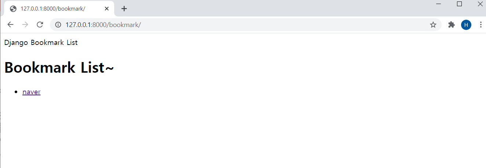
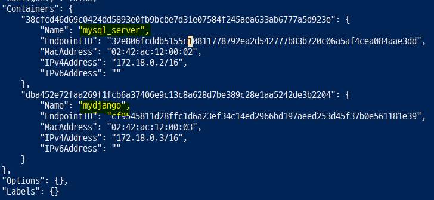
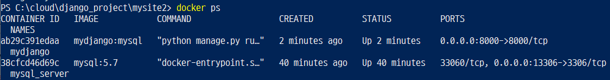
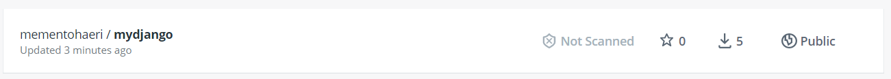
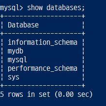
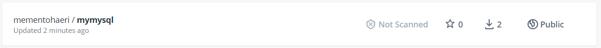
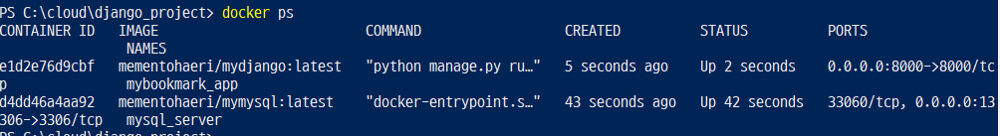

# Django project - Docker Deployment

> 장고프로젝트 생성 후 Docker로 배포하기

### 1. Dockerfile 수정하기 (COPY 명령어 이용)
- **COPY <복사할 파일 경로> <이미지에서 파일이 위치할 경로>** : 호스트 OS 파일 또는 디렉토리를 컨테이너 안의 경로로 단순 복사
- **EXPOSE <포트번호>** : 호스트와 연결할 포트 번호 설정 (이 자체로 포트포워딩은 아님) -> 도커 엔진이 열려있는 포트를 찾아 호스트 포트와 매핑시켜준다.

```dockerfile
# Dockerfile
FROM python:3.7.9-stretch

WORKDIR /mydjango

RUN apt-get update
RUN apt-get install -y vim
RUN pip install django
RUN pip install mysqlclient

COPY bookmark /mydjango/bookmark
COPY mysite2 /mydjango/mysite2
COPY db.sqlite3 /mydjango/db.sqlite3 
COPY manage.py /mydjango/manage.py

EXPOSE 8000

CMD ["python","manage.py","runserver","0.0.0.0:8000"]
```

1. 빌드

```
$ docker build --no-cache=true -t mydjango_app:copy .
```
<br/>
2. 컨테이너 실행

```
$ docker run -d -p 8000:8000 -it --name mydjango mydjango_app:copy
$ docker ps		//컨테이너 실행 중인지 확인
```
<br/>

3. http://127.0.0.1/bookmark 서버 접속 확인하기


<br/>
4. Volume Mount가 설정되지 않았기 때문에 파일을 수정하기 위해 컨테이너 안으로 들어가야 한다.
- 아래 명령어를 통해 bookmark_list.html 파일을 수정한 후 서버에 접속하면 변경 사항 반영된다.
- **Volume Mount가 사용자 입장에서 편리하지만, 실제 서비스를 운영할 땐 Dockerfile의 COPY 사용한다.**

```
$ docker exec -it mydjango /bin/bash
# ls -al

# apt-get update
# apt-get install tree
# tree -L 2 	//파일 구조 확인 

# vi bookmark/templates/bookmark/bookmark_list.html		//파일 수정
```
<br/>

<br/>

### 2. Bridge 네트워크 생성

1. 네트워크 생성

```
$ docker network create my-network
$ docker network ls
```
<br/>
2. Mysql, Django 컨테이너를 my-network 네트워크에 추가

```
// mysql_server 컨테이너 실행 
$ docker run -d -p 13306:3306 -e MYSQL_ALLOW_EMPTY_PASSWORD=true -v C:\cloud\django_project\db_mount:/var/lib/mysql --network my-network --name mysql_server mysql:5.7

// mydjango 컨테이너는 앞서 생성하였으므로 이번에는 명령어로 직접 네트워크에 연결
$ docker network connect my-network mydjango
$ docker inspect my-network
```

명령어 수행 직후, 아래와 같이 mysql_server 컨테이너와 mydjango 컨테이너가 my-network 네트워크에 연결되었음을 확인할 수 있다.


<br/>

<br/>

### 3. Django의 Database 변경 (sqlite3 -> mysql)

1. 장고프로젝트에서 `mysite2/settings.py` 파일의 DATABASES 영역을 수정한다.
- DB 연동 부분을 sqlite3에서 mysql로 수정

```python
# settings.py
DATABASES = {
    'default': {
        # 'ENGINE': 'django.db.backends.sqlite3',
        # 'NAME': os.path.join(BASE_DIR, 'db.sqlite3'),
        'ENGINE':'django.db.backends.mysql',
        'NAME':'mydb',
        'USER':'root',
        'PASSWORD':'',
        'HOST':'127.0.0.1',
        'PORT':'13306'
    }
}
```

```
$ python .\manage.py makemigrations
$ python .\manage.py migrate
$ python .\manage.py createsuperuser
$ python .\manage.py runserver	// 서버에 정상적으로 접속되는지 확인
```
<br/>
2. (OPTIONAL) 윈도우에서 장고 서버가 올바르게 작동하는지 확인

```
$ docker exec -it mysql_server /bin/bash
# mysql -h127.0.0.1 -uroot
> use mydb;
> show tables;
> select * from bookmark_bookmark;
```
<br/>
3. mysql_server 컨테이너와 mydjango 컨테이너 연결
- `docker run -d -p 13306:3306 -e MYSQL_ALLOW_EMPTY_PASSWORD=true -v C:\cloud\django_project\db_mount:/var/lib/mysql --network my-network --name mysql_server mysql:5.7`  명령어를 통해 mysql_server 컨테이너를 생성하였기에 호스트에서 13306 포트를 통해 컨테이너에 접속하며, HOST는 mysql_server, PORT는 3306으로 설정

```python
# settings.py
DATABASES = {
    'default': {
        # 'ENGINE': 'django.db.backends.sqlite3',
        # 'NAME': os.path.join(BASE_DIR, 'db.sqlite3'),
        'ENGINE':'django.db.backends.mysql',
        'NAME':'mydb',
        'USER':'root',
        'PASSWORD':'',
        'HOST':'mysql_server',
        'PORT':'3306'
    }
}
```

```
$ docker build -t mydjango:mysql . 
$ docker run -d -it -p 8000:8000 --network my-network --name mydjango mydjango:mysql 
```

모든 과정이 끝난 후 웹 서버 (http://127.0.0.1/bookmark) 확인해보기
<br/>

### 4. (OPTIONAL) docker run 명령어에 환경 변수로 database 설정하기

```
$ docker run -d -it -p 8000:8000 -e MYSQL_ALLOW_EMPTY_PASSWORD=true -e MYSQL_DATABASE=mydb --network my-network --name mydjango mydjango:mysql  
```


<br/>

1. docker image를 hub에 공개하기 위한 tag 변경

```
$ docker tag mydjango:mysql mementohaeri/mydjango:latest
```
<br/>
2. docker image를 hub에 올리기

```
$ docker push mementohaeri/mydjango:latest
```


<br/>

### 5. MYSQL용 Dockerfile 생성

- 경로 수정 `C:\cloud\django_project`
- **ENV** : 환경변수 설정

```dockerfile
# Dockerfile
FROM mysql:5.7

ENV MYSQL_ALLOW_EMPTY_PASSWORD true
ENV MYSQL_DATABASE mydb
EXPOSE 3306

COPY db_mount /var/lib/mysql 

CMD ["mysqld"]
```
<br/>
1. 빌드

```
$ docker build --no-cache=true -t mymysql . 
```
<br/>
2. 실행

```
$ docker run -d -p 23306:3306 --network my-network --name mysql_server2 mymysql:latest
$ docker exec -it mysql_server2 /bin/bash
# mysql -h127.0.0.1 -uroot
> show databases;
```
<br/>
위 명령어 수행하면 쉘에서 `create database mydb;` 를 실행하지 않았는데도 Dockerfile로 인해 자동으로 mydb 데이터베이스가 생성되어 있다.


<br/>
3. DB 뿐만 아니라 테이블까지 자동 생성

```
$ docker build -t mymysql .
$ docker run -d -p 13306:3306 --network my-network --name mysql_server mymysql
$ docker tag mymysql:latest mementohaeri/mymysql:latest 
$ docker push mementohaeri/mymysql:latest
```



<br/>

```
$ docker run -d -p 13306:3306 --network my-network --name mysql_server mementohaeri/mymysql:latest
$ docker run -d -p 8000:8000 --network my-network --name mybookmark_app mementohaeri/mydjango:latest
$ docker ps
```



이후 http://127.0.0.1/bookmark 접속 가능해야 함