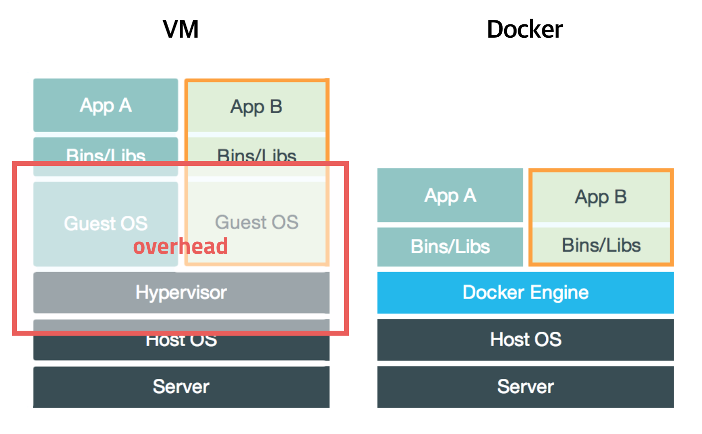
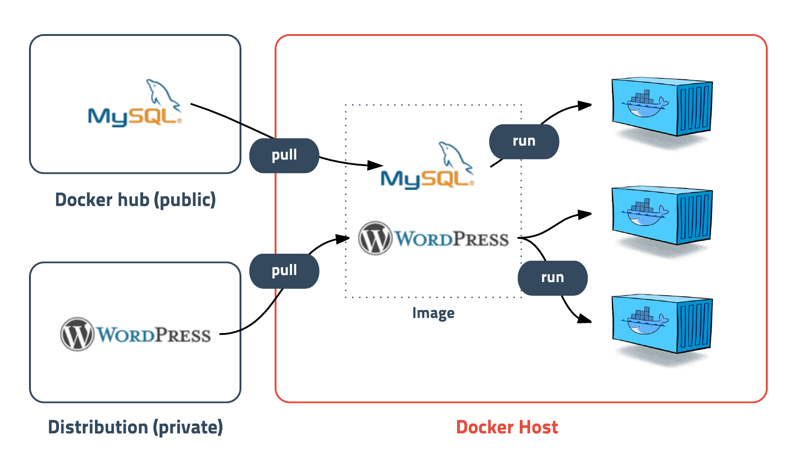
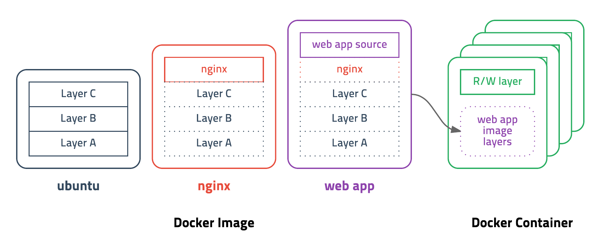
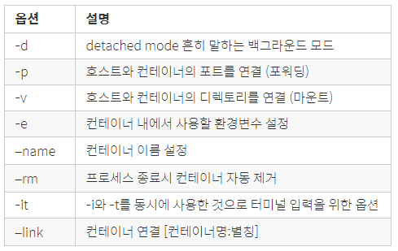

# Docker

> 컨테이너 기반의 오픈소스 가상화 플랫폼
>
> Back-end Program, DB, Message Queue를 컨테이너로 추상화 가능하다.
> 
> 일반 pc, AWS, Azure, Google Cloud 등에서 실행 가능하다. 

<br/>

1. 기존 가상화 방식 
- OS 를 가상화
- VMWare, VirtualBox (HostOS위에 GuestOS 전체를 가상화)
- 무겁고 느림
<br/>

2. CPU의 가상화 기술 이용 방식
- Kernal-Based virtual machine
- 전체 OS 가상화 하지 않음 / 호스트 형식에 비해 속도 향상
- OpenStack, AWS 등의 클라우드 서비스
- 추가적인 OS는 여전히 필요했고 성능문제 있었음
<br/>

3. 프로세스 격리 -> 리눅스 컨테이너
- CPU, 메모리는 필요한 만큼만 사용
- 성능 손실 거의 없음
- 컨테이너는 독립적인 공간을 가져 서로 영향을 주지 않음
- **컨테이너 생성 속도 빠름 (1-2초 내)**


<br/>

**Docker Image** (= OS + Middleware) : 컨테이너 실행에 필요한 파일과 설정값 등을 포함 

- **상태값 없음** -> 고유한 정보가 없다.
- **실체화** -> Container (실행하는 환경에 따라 정보가 추가되어 사용할 수 있는 상태) 



- Docker Hub (public) 에 등록하거나 Docker Repository (private) 저장소를 만들어 관리한다. 
-> 공개된 도커 이미지는 50만개 이상, 다운로드 수는 80억회 이상
- **Layer 저장방식** : 유니온 파일 시스템을 이용하여 여러 개의 layer를 하나의 파일 시스템으로 사용



<br/>

Dockerfile : Docker Image를 생성하기 위한 **스크립트 파일**
- 자체 DSL (Domain-Specific Language) 언어 사용 -> 이미지 생성과정 기술
- 소스와 함께 버전관리가 되어 누구나 수정 가능
- 스크립트 파일을 작성하면 도커엔진에서 이를 도커 이미지로 생성

```shell
FROM subicura/vertx3:3.3.1		#base image 지정 (계정/이미지명:태그명)
MAINTAINER chungsub.kim@purpleworks.co.kr	#작성자

ADD build/distributions/app-3.3.1.tar/	#Dockerfile이 실행되는 서버의 디렉토리 위치
ADD config.template.json / app-3.3.1/bin/config.json
ADD docker/script/start.sh /usr/local/bin
RUN ln -s /usr/local/bin/start.sh /start.sh

EXPOSE 8080		#포트전환 -> 8080번 포트 open
EXPOSE 7000		#7000번 포트 open

CMD ["start.sh"]	#실행
```
<br/>

docker 설치 확인 : `docker version`
<br/>

**컨테이너 실행** (=pull+create+start): `docker run [OPTIONS] IMAGE[:TAG|@DIGEST][COMMAND][ARG...]`

- ubuntu 16.04 컨테이너 생성하고 컨테이너 내부 접속 `docker run ubuntu:16.04`
- --name 옵션 생략 시 도커가 자동으로 이름 지어준다.



```
#컨테이너 실행 방법 1
$ docker image pull ubuntu
$ docker container create ubuntu:16.04
$ docker container start [id]
$ docker container ls -a	# 사용자가 명시한 기능이 없기 때문에 컨테이너가 실행은 됐으나 곧바로 exited 된다.

#컨테이너 실행 방법 2
$ docker run ubuntu:16.04
```
<br/>

- 컨테이너는 프로세스이기 때문에 실행 중인 프로세스가 없으면 컨테이너는 종료된다.
	- `docker run --rm -it ubuntu:16.04 /bin/bash` : --rm은 컨테이너가 stop되면 자동 remove된다. (docker rm은 컨테이너 삭제 / docker rmi는 이미지 삭제 명령어)
	- root@[**컨테이너 id**] -> 컨테이너 id = 호스트네임


<br/>

**MySQL 5.7 서버 Container 실행** 

-  `docker run -d -p 3306:3306 -e MYSQL_ALLOW_EMPTY_PASSWORD=true --name mysql mysql:5.7`  -> host port(3306): container port(3306) 

   - 다음과 같은 오류 발생 시 `docker container rm mysql`을 통해 mysql 컨테이너 삭제<br/>
   Error response from daemon: Conflict. The container name "/mysql" is already in use by container "36a488c0b3fe7deb3758954f8118e1f956911b0aee4a48dc6702e8f9a1d44e77". You have to remove (or rename) that container to be able to reuse that name.
-  `docker exec -it mysql bash` : 생성한 mysql 컨테이너 안으로 접속
-  `mysql -h127.0.0.1 -uroot -p` : mysql로 접속


