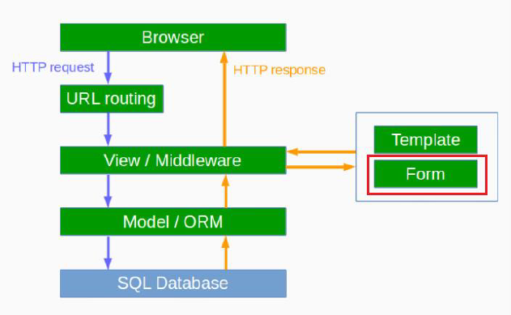

# Python Web Programming with Django (3)

## Product App 작성

### Django Form (글 추가)

> Form 
>
> - template과 연결되어 사용자로부터의 입력을 처리한다.
> - Custom Form Class를 통해 입력 폼 HTML 생성(.as_table(), .as_p(), .as_ul())제공 / 입력 폼 값 검증 및 값 변환
>   - client, server 모두 format에 맞는기 검증하지만 client side에서만 검증 로직을 구현하는 노출되는 단점이 있다. 따라서 server side의 검증 로직도 필요하다.
> - GET/POST로 나눠 Form 처리 
>   - GET: 입력 폼을 보여준다. (단순히 서버의 내용을 조회하는 경우)
>   - POST: 데이터를 입력 받아 유효성 검증 과정을 거친다. (서버의 데이터를 변경하는 경우)
>     - 검증 성공: 해당 데이터 저장하고 SUCCESS URL로 이동
>     - 검증 실패: 오류 메시지와 함께 입력 폼 다시 보여준다.



1. Model Form

- 특정 Model로부터 필드 정보를 읽어 들여 fields를 세팅한다.

  ``` 
  class PostForm(forms.ModelForm):
  	class Meta:
  		model=Post
  		fields= '__all__' # 전체 필드 지정
  ```

  