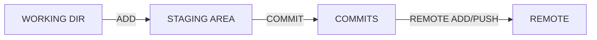
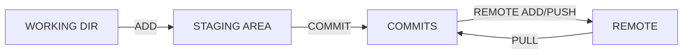

# git의 작업 흐름

1. **add: 커밋할 목록에 추가**
2. **commit: 커밋 (create a snapshot) 만듦**
3. **push: 현재까지의 역사 (commits)가 기록되어 있는 곳에 새로 생성한 커밋들 반영**

### 0. 준비

- `git config --global user.email "이메일주소"` : 사용자의 git 이메일 설정
- `git config --global user.name "사용자이름"` : 사용자의 username 설정
- `git config --global -l` :  config global에 저장된 이름과 이메일 확인 가능

### 1. 일반적인 프로세스

​		----------------------------------------------local-------------------------------------------------

- `git init` : 현재 디렉토리 기준으로 git 저장소 생성 (.git 생성)

- `git add <파일>` :  working dir에서 작업한 파일을 staging area로 올리는 과정

- `git commit -m "커밋메시지"` : 작업한 파일에 대한 설명 / 현재 버전에 대한 내용 설명

  ----------------------------------------------remote---------------------------------------------

- `git remote add origin <원격저장소 주소>` :  <원격저장소 주소>를 origin이라는 이름으로 등록

  - local의 과정이 마친 후 github페이지로 이동하면 `git remote add` 명령어 찾을 수 있음

- `git push origin main`: 커밋한 내용이 원격저장소의 repository에 저장됨

  -  main의 data를 origin 주소로 옮긴다는 의미
  -  cf. 원래 `git push origin master` 명령어로 사용하고 있었으나 black lives matter 운동으로 인해 현재는 master자리에 main으로 쓰임

### 2. 참고사항

- `git log` : 그동안 저장했던 정보들 출력
  - `git log --oneline` : 그동안 저장했던 로그를 한 줄로 간단하게 출력
- `git diff` : 지금 저장된 문서와 commit 했을 때의 문서와 다른점
- `git status` : 현재 파일의 상황/상태를 확인

`git log`와 `git status` 명령어는 자주 사용하여 파일의 상태와 커밋 내역들이 github 페이지와 싱크가 맞는지 확인하는 게 좋다.

### 3. pull /branch/merge

- `git pull origin main` : 원격저장소로부터 파일의 변경사항을 로컬에 업데이트

  

- `git branch` : 현재 생성되어 있는 branch 정보 나타냄
  
  - *branch 라면 현재 사용하고 있는 branch를 의미
  
- `git branch <이름>` : branch 생성

- `git checkout <이름>` : <이름> branch 로 이동
  
  - git 2.23 이상부터는 `git switch <이름>`
  
- `git branch -d <이름>` : <이름> branch 삭제 (단, 해당 branch에서 활동중이지 않을 경우)

보통 협업을 할 때 다중 branch를 생성하는데, master branch에서는 별도의 commit은 하지 않는 편이며, 이 곳에서 직접적으로 파일을 수정하는 일은 없어야 한다. 보통 다른 branch에서 코드를 작성 및 병합하여 이를 master branch로 옮긴다.

수명(기능)을 다한 branch는 지워주는게 좋다.

- `git merge <branch>` : 다른 <branch>의 내용과 병합

- `git log --oneline --graph` : branch 병합 상황을 시각적으로 확인 가능

### 4. 명령어 취소 및 수정

`git add`, `git commit` 과 같은 명령어는 항상 심사숙고하는게 좋다. 협업자의 커밋과 충돌날 가능성이 매우 크기 때문에 가급적 사용하지 않는 편이 좋다.

- `git reset HEAD <파일명>` : staging area에 있는 두 개의 파일 중 하나를 working dir로 옮기고 싶을 때 
- `git commit --amend` : 바로 이전의 메시지만 수정 가능, vim 편집기로 수정
- `git commit HEAD^` : commit 기록 자체를 취소
- `git commit HEAD^^` : 바로 이전의 두 개의 commit 취소
- `.gitignore` : 프로젝트에서 제외하고 싶은 파일 및 폴더가 있을 경우
  - gitignore.io 홈페이지 참고