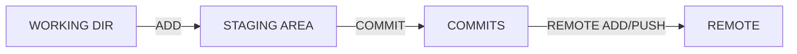

# git의 작업 흐름

1. **add: 커밋할 목록에 추가**
2. **commit: 커밋 (create a snapshot) 만듦**
3. **push: 현재까지의 역사 (commits)가 기록되어 있는 곳에 새로 생성한 커밋들 반영**

### 0. 준비

- `git config --global user.email "이메일주소"` : 사용자의 git 이메일 설정
- `git config --global user.name "사용자이름"` : 사용자의 username 설정
- `git config --global -l` :  config global에 저장된 이름과 이메일 확인 가능

### 1. 일반적인 프로세스

​		----------------------------------------------local-------------------------------------------------

- `git init` : 현재 디렉토리 기준으로 git 저장소 생성 (.git 생성)

- `git add <파일>` :  working dir에서 작업한 파일을 staging area로 올리는 과정

- `git commit -m "커밋메시지"` : 작업한 파일에 대한 설명 / 현재 버전에 대한 내용 설명

  ----------------------------------------------remote---------------------------------------------

- `git push origin main`: 커밋한 내용이 원격저장소의 repository에 저장됨

  -  main의 data를 origin 주소로 옮긴다는 의미 