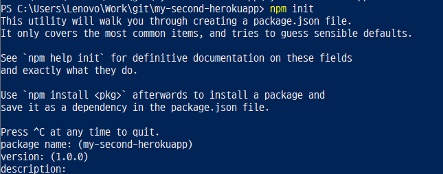

# heroku-git 연동

1. heroku.com에 접속하여 [new] -> [create new app] 에서 app이름을 my-second-herokuapp 라고 짓는다.
2. Deployment method 탭의 Github (connect to Github)를 위해 우선 github에서 repo를 새로 생성한다.
3. github로 이동하여 my-second-herokuapp이름으로 repo를 만든다.
C:\Users\Lenovo\Work\git\my-second-herokuapp 경로로 이동하여 아래의 명령어를 수행한다.

```
$ git init
$ git remote add origin https://github.com/mementohaeri/my-second-herokuapp.git
$ git clone https://github.com/mementohaeri/my-second-herokuapp.git
```
<br/>

4. `npm init` : node 프로그램을 시작하는 명령어로 package.json 파일을 생성한다.
- 앞으로 node.js 코드를 작성할 예정

<br/>

5. `npm install express --save` : express 모듈을 설치한다.

6. app.js, package.json 파일을 작성 및 수정한다.

```javascript
# app.js
const express = require('express')  
const app = express();
const port = process.env.PORT || 3000;

//http://127.0.0.1:3000/welcome?name=haerim
app.get('/', (req,res) => res.send('Hello, NodeJS!'));
app.get('/welcome', (req,res)=> {
    var user_name = req.param('name');
    res.send('Hi, there. Welcome to the Nodejs service. ['+ user_name +']');
});
app.get('/check', (req,res)=> res.send('Example app listening on port 3000'));

app.listen(port, ()=> console.log('Example app listening on port 3000'))

```

```json
# package.json
  ...
  "scripts": {
    "start" : "node app.js",
    "test": "echo \"Error: no test specified\" && exit 1"
  },
  ...
```
<br/>

7. `npm start` 입력 후 127.0.0.1:3000 로 접속하여 정상적으로 접속되는지 확인한다.


<br/>

8. github에 작성한 코드를 add, commit, push 하기
- 단, `git add app.js package.json` 와 같이 필요한 파일만 업로드하기 (필요없는 파일 용량차지 할 수 있다)

9. 2번 단계로 돌아가서 heroku 웹페이지의 App Connected to Github 섹션에서 repo이름을 적고 'Connect' 누른다. 빈 repo가 아니므로 이번에는 연결된다!

<br/>

10. 본격적으로 github와 heroku를 연동하기 위해 heroku cli인 heroku toolbelt를 설치한다. 
정상적으로 설치가 되었는지 확인하려면 `heroku --version` -> `heroku login` -> `heroku list`를 통해 현재 생성된 앱을 확인한다.

<br/>

11. `heroku git:remote -a [앱 이름]` 와 `git remote -v` 명령어 수행을 통해 아래와 같이 총 4개의 git주소가 나타남을 확인한다.

<br/>

12. `git push heroku master` : heroku로 배포작업을 시작한다.


<br/>

마지막 작업 창에 나오는 도메인 주소는 브라우저 및 휴대폰을 통해 접속 가능하다.
 
<br/>

13.  이후 heroku와 github이 제대로 연동되었다면 Automatic deploys, Manual deploy도 가능하다.