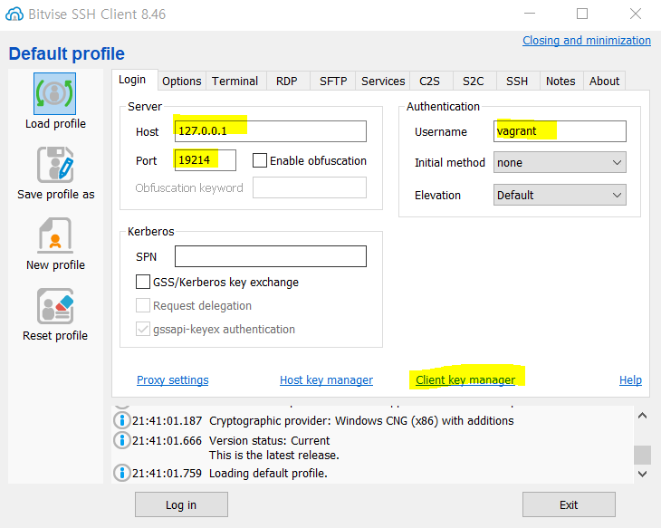
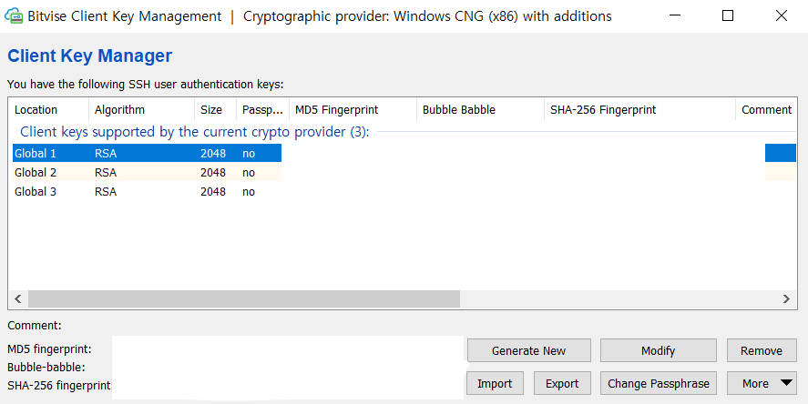
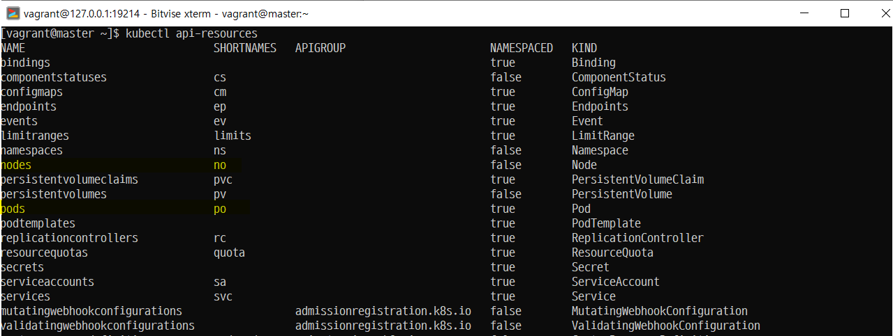
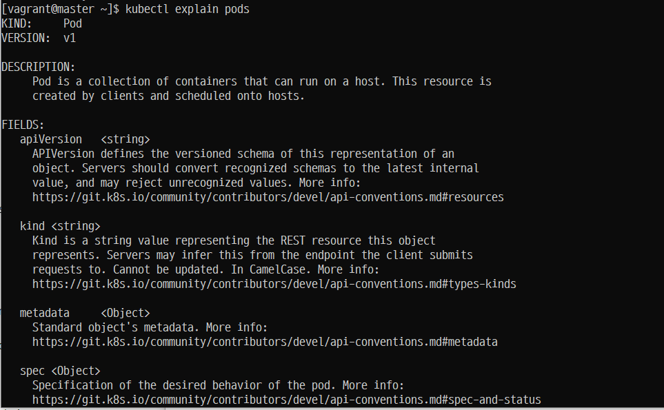
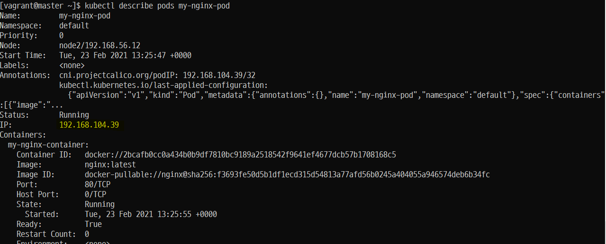
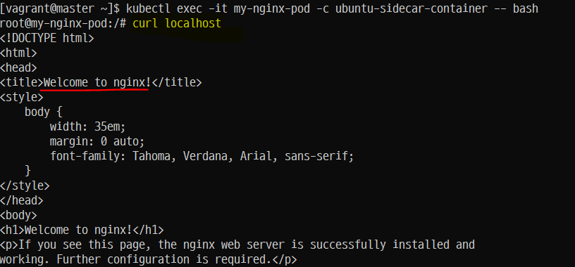
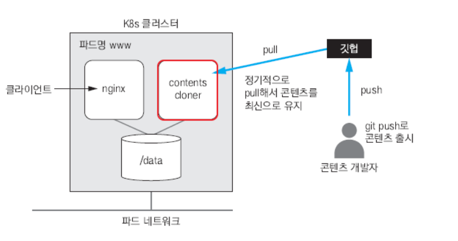

# Bitvise SSH Client

Bitvise: xshell과 같이 가상머신에 ssh 접속을 위해 사용한다.

<br/>

### 접속 방법

0. 가상머신 상태 확인 및 실행 -> `vagrant status` , `vagrant up`

1. Master 노드 접속을 위해 server host 는 127.0.0.1로, port는 19214로 지정한다. 
Authentication의 username을 vagrant로 지정한 뒤, 하단의 client key manager를 클릭하여 부여 받은 키를 등록한다.



2. Import -> `vagrant ssh-config master`명령어를 통해 IdentifyFile 경로 알아두기 
- C:\cloud\vagrant\.vagrant\machines\master\virtualbox\private_key 와 같은 경로라면, private_key 이전까지의 경로로 가서 키 등록하기  


  

3. Master, Node1, Node2 총 3개의 노드에 대해 위의 작업 반복 후 New terminal console을 통해 접속하기
- Master: 19214 / Node1: 19211 / Node2: 19212
<br>
4. The connection to the server localhost:8080 was refused - did you specify the right host or port? 에러 → master 노드에서 아래 명령어를 실행

```
[vagrant@master ~]$ mkdir -p $HOME/.kube
[vagrant@master ~]$ sudo cp -i /etc/kubernetes/admin.conf $HOME/.kube/config
[vagrant@master ~]$ sudo chown $(id -u):$(id -g) $HOME/.kube/config
```

<br>

5. 노드 status가 not ready인 경우

```
[vagrant@node1 ~]$ sudo systemctl restart kubelet
[vagrant@node1 ~]$ systemctl status kubelet
```


<br>

<br>

# Kubernetes (k8s)

쿠버네티스 : 컨테이너 오케스트레이션 도구의 표준 

### 쿠버네티스 설치 환경

1. 개별 용도 : minikube, docker for mac/windows에 내장된 쿠버네티스 사용 
- 별도 설치 없이 사용 가능 but 다중 노드에서의 실행은 확인 불가

2. 서비스 테스트 or 운영 용도 : kops, kubespray, kubeadm, EKS/GKE 등에서 제공하는 managed service 사용

<br/>

### 쿠버네티스에서 사용가능한 오브젝트 확인

사용가능한 오브젝트와 함께 shortname 확인 가능하다.

```
[vagrant@master ~]$ kubectl api-resources
```



따라서 명령어를 입력할 때 `kubectl get nodes`와 `kubectl get no`는 같은 결과를 출력


<br>

### 특정 오브젝트에 대한 상세 설명 확인

```
[vagrant@master ~]$ kubectl explain pods
```



<br>

<br>

# Pod

pod: 컨테이너 애플리케이션의 기본 단위
	: 1개 이상의 컨테이너로 구성된 컨테이너의 집합
	: 여러 컨테이너를 추상화하여 하나의 애플리케이션으로 동작하도록 만드는 컨테이너 묶음

### nginx 컨테이너로 구성된 pod 생성

1. nginx-pod.yaml (매니페스트 파일)을 생성한다.

```
[vagrant@master ~]$ vi nginx-pod.yaml
```

```yaml
# nginx-pod.yaml
apiVersion: v1    # YAML 파일에서 정의한 오브젝트의 api 버전
kind: Pod         # 리소스의 종류 
metadata:         # 리소스의 부가 정보 (이름, 라벨, 주석)
  name: my-nginx-pod
spec:             # 리소스 생성을 위한 정보
  containers:
    - name: my-nginx-container
      image: nginx:latest
      ports:
      - containerPort: 80
        protocol: TCP
```

2. 쿠버네티스 클러스터에 새로운 pod를 생성하고 생성된 pod 확인한다.

```
[vagrant@master ~]$ kubectl apply -f nginx-pod.yaml
[vagrant@master ~]$ kubectl get pods
```


3. 생성된 pod의 상세 정보 확인

```
[vagrant@master ~]$ kubectl describe pods my-nginx-pod
```



아래의 명령어도 pod가 어느 노드에 생성되었는지와 ip 주소를 함께 확인할 수 있다.

```
[vagrant@master ~]$ kubectl get pods -o wide
```


4. 클러스터 내부에 테스트용 pod 임시 생성하여 nginx 동작 확인

```
[vagrant@master ~]$ kubectl run -it --rm debugpod --image=alicek106/ubuntu:curl --restart=Never bash
```


이 때 다른 터미널을 열어 debugpod (nginx 동작 확인을 위해 임시로 만든 pod) 가 실행 중임을 알 수 있다.


5. 임시 생성한 pod 중지 및 삭제

- 파드 삭제 : `kubectl delete pod [POD_NAME]`  or `kubectl delete -f [YAML_FILE]`

```
[vagrant@master ~]$ kubectl delete pod debug
```

6. pod 로그 확인


7. my-nginx-pod 삭제

```
kubectl delete -f nginx-pod.yml
```


<br>

### nginx, ubuntu 두 개의 컨테이너를 하나의 pod로 구성

1. nginx-pod-with-ubuntu.yaml (매니페스트 파일)을 생성한다.

```yaml
# nginx-pod-with-ubuntu.yaml
apiVersion: v1
kind: Pod
metadata:
  name: my-nginx-pod
spec:
  containers:
    - name: my-nginx-container
      image: nginx:latest
      ports: 
        - containerPort: 80
          protocol: TCP
    - name: ubuntu-sidecar-container  # nginx가 제대로 동작하는지 확인하는 컨테이너
      image: alicek106/rr-test:curl
      command: ["tail"]
      args: ["-f", "/dev/null"] # tail -f /dev/null 실행
```

2. 매니페스트 파일 적용

```
[vagrant@master ~]$ kubectl apply -f nginx-pod-with-ubuntu.yaml
[vagrant@master ~]$ kubectl get pods
```


3. 명령어를 수행할 컨테이너(ubuntu-sidecar-container)를 지정 -> 우분투 컨테이너의 localhost에서 nginx 접속 확인



<br>

<br>

# 사이드카 패턴

웹 서버 컨테이너와 github에서 최신 컨텐츠를 가져오는 컨테이너를 하나의 파드로 묶음



1. github에서 정기적으로 컨텐츠 다운받는 쉘 파일 작성

```sh
# contents-cloner

#!/bin/bash       

if [ -z $CONTENTS_SOURCE_URL ]; then
    exit 1
fi

# 있는 경우 - (처음) git clone을 통해서 컨텐츠 가져오기
git clone $CONTENTS_SOURCE_URL /data

# 이후 60초마다 깃허브에서 컨텐츠 가져오기
cd /data
while true
do
    date
    sleep 60
    git pull
done
```

2. github에서 정기적으로 컨텐츠 다운받는 컨테이너 이미지 작성을 위한 Dokerfile 생성

```dockerfile
FROM ubuntu:16.04
RUN apt-get update && apt-get install -y git
COPY ./contents-cloner /contents-cloner
RUN chmod a+x /contents-cloner
WORKDIR /
CMD ["/content-cloner"]
```

3. Dockerfile 작성 후, 이미지 빌드 및 레지스트리에 등록

```
[vagrant@master sidecar]$ docker build --tag mementohaeri/c-cloner:0.3 .
[vagrant@master sidecar]$ docker images	//이미지 빌드 확인
[vagrant@master sidecar]$ docker login	//hub 로그인 확인
[vagrant@master sidecar]$ docker push mementohaeri/c-cloner:0.3
```

4. github repo 생성 (mementohaeri/web-contents)

- 임의의 index.html 파일 생성

5. 사이드카 패턴의 pod를 생성하는 yaml 파일 작성

```yaml
# webserver.yaml

apiVersion: v1
kind: Pod
metadata:
  name: webserver
spec:
  containers:
    - name: nginx							# 주기능 수행 컨테이너
      image: nginx
      volumeMounts: 
        - mountPath: /usr/share/nginx/html	# nginx 웹 루트 디렉터리
          name: contents-vol
          readOnly: true
    - name: cloner							# 보조기능 수행 컨테이너 (사이드카 컨테이너)
      image: mementohaeri/c-cloner:0.3		
      env:
        - name: CONTENTS_SOURCE_URL			# github repo 주소
          value: "https://github.com/mementohaeri/web-contents"
      volumeMounts: 
        - mountPath: /data					#github에서 가져온 데이터가 쌓이는 곳
          name: contents-vol
          readOnly: true
  volumes:
    - name: contents-vol
      emptyDir: {}
```

6. pod 생성 및 확인

```
[vagrant@master sidecar]$ kubectl apply -f webserver.yaml
[vagrant@master sidecar]$ kubectl get pods -o wide
```


7. 대화형 pod 기동하여 pod의 초기 컨텐츠 출력

- github 내용 출력해야하는데 에러 (추후 수정)

```
[vagrant@master sidecar]$ kubectl run busybox --image=busybox --restart=Never --rm -it sh
If you don't see a command prompt, try pressing enter.
/ # wget -q -O - http://192.168.104.42
```

<br>

<br>

# Troubleshooting

1. 도커 명령어 실행 시 **Got permission denied while tryint to connect to the Docker daemon socket at ~** 에러 발생

```
# 1번 방법
[vagrant@master sidecar]$ sudo usermod -a -G docker $USER
[vagrant@master sidecar]$ sudo service docker restart
Redirecting to /bin/systemctl restart docker.service

# 2번 방법 (위 방법으로 해결 안될 때)
[vagrant@master sidecar]$ sudo chmod 666 /var/run/docker.sock
```

2. pod 생성 시 **Pending** 혹은 **CrashLoopBackOff**  에러 발생

- 특정 컨테이너의 로그에서 *standard_init_linux.go:219: exec user process caused: no such file or directory* 출력 시, 이는 쉘 스크립트에 개행문자가 잘못 들어간 경우이므로 Visual Studio Code에서 개행문자를 CRLF -> LF로 변경

```
[vagrant@master sidecar]$ kubectl logs webserver -c cloner	
```

